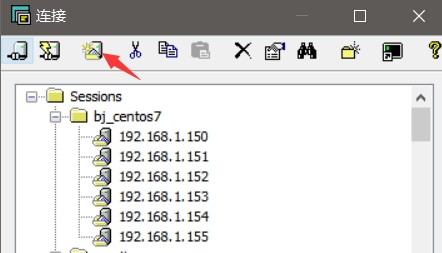
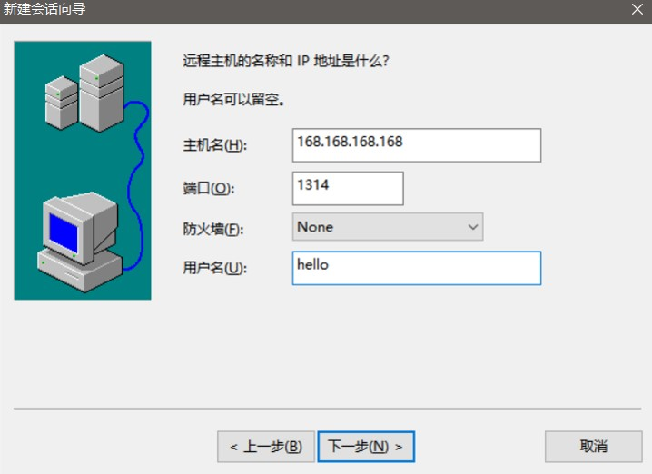
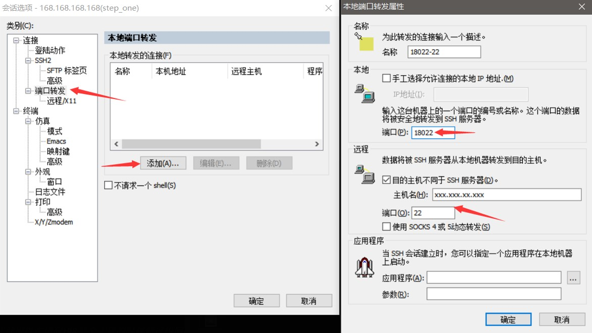
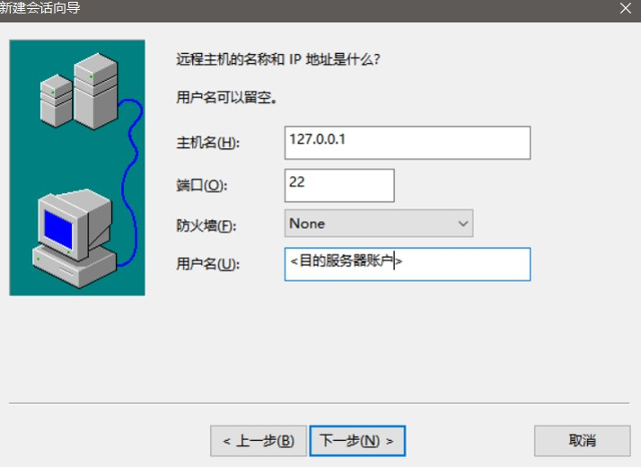
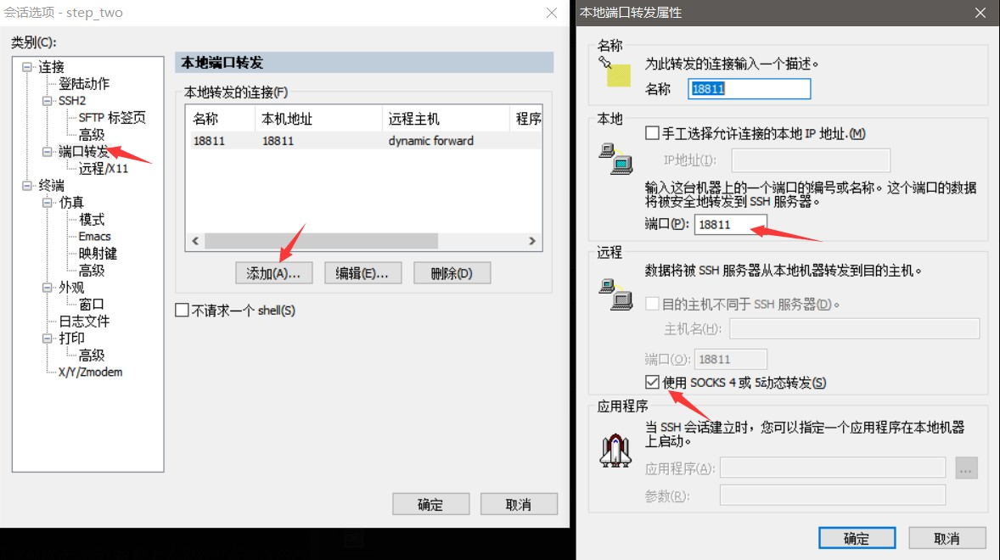
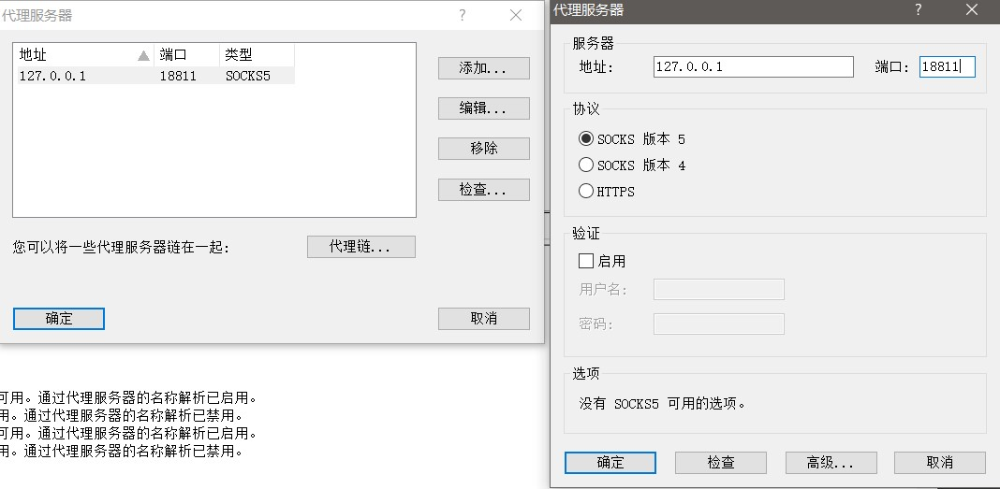
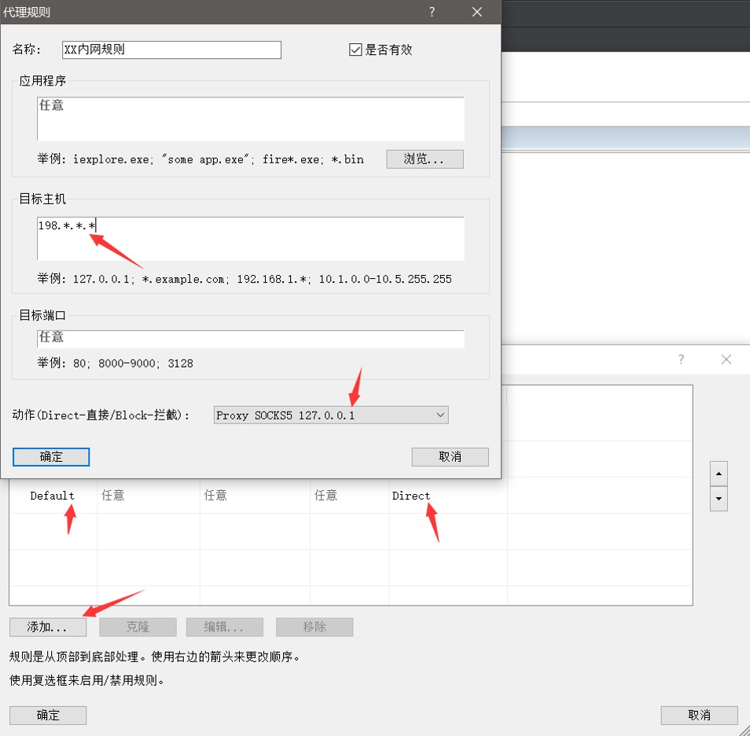

# CRT + Proxifier 映射内网地址到本地

### 目录
* [1.准备](#prepare)
* [2.安装CRT](#install_crt)
* [3.安装Proxifier](#install_proxifier)
* [4.正式开搞](#start_mapping)

## 
<h3 id="prepare">准备在前</h3>
1. 公网跳板机 假设为: hello@168.168.168.168:1314
2. CRT软件
3. Proxifier软件

## 
<h3 id="install_crt">安装CRT</h3>

 [下载地址](https://www.vandyke.com/products/securecrt/)

按照推荐安装就行

## 
<h3 id="install_proxifier">安装Proxifier</h3>

 [下载地址](https://www.proxifier.com/)

## 
<h3 id="start_mapping">开始映射</h3>
##### 1.CRT中点击新建。

##### 2.建立公网跳板机的SSH会话(step_one)，会话名自定义就好。

##### 3.点击刚创建的会话属性，添加本地端口转发，转发18022到目标内网服务器SSH端口。

##### 4.创建一个新的SSH会话(step_two)，地址是本地127.0.0.1，端口号和第3步的本地转发端口相同，这样就可以通过本地登陆到内网服务器。

##### 5.给step_two会话设置本地端口转发。

##### 6.在proxifier上添加本地代理服务器。

##### 7.在proxifier上添加地址命中规则，支持通配符，这样就可以在访问198整个大段的时候通过内网服务器来访问了。

##### 创建完毕之后，想要启动整个映射，只需要把proxifier打开，把CRT打开，依次连接step_one,step_two会话，第7步设置的地址就可以通过内网服务器访问了。
##### 想要多级跳转也只不过是重复2-5步而已。

